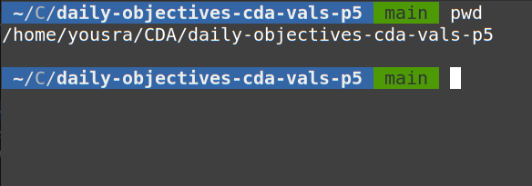

# Linux-terminal-cheatsheet
---------------------------
## Authors : Yousra, Axel, Constant, Mathéo
## Cheat sheet linux terminal commands

|Commande| Description | Exemple|
|--------|-------------|--------|
|*pwd*|Affiche le chemin absolu du répertoire actuel.||
